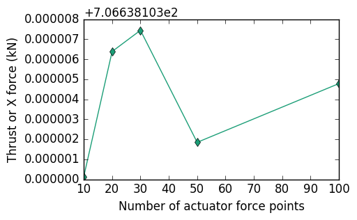

.. _cppapi:

How to use the OpenFAST C++ API
===============================

**Under construction.**

The C++ API is defined and implemented in the :class:`~fast::OpenFAST` class. Any user who wants to write a glue-code for OpenFAST in C++ should instantiate an object of the OpenFAST class and use it to drive the simulation of turbines. A sample glue-code `FAST_Prog.cpp <https://github.com/OpenFAST/openfast/blob/dev/glue-codes/fast-cpp/src/FAST_Prog.cpp>`_ is provided as a demonstration of the usage of the C++ API. The glue-code allows for the simulation of multiple turbines using OpenFAST in serial or in parallel over multiple processors. The message passing interface (MPI) is used to run the different instances of turbines in parallel. An abbrievated version of FAST_Prog.cpp is shown below. The highlighted lines indicate the use of the OpenFAST class.

.. literalinclude:: files/FAST_Prog.cpp
   :emphasize-lines: 1,27,28,32,36,38,40,45,49
   :language: C++

All inputs to the OpenFAST class are expected through an object of the :class:`fast::fastInputs`.

.. doxygenclass:: fast::fastInputs
   :members:
   :private-members:
   :protected-members:
   :undoc-members:

The object of :class:`~fast::fastInputs` class is expected hold a struct vector of type :class:`~fast::globTurbineDataType` and size of the number of turbines in the simulation.

.. doxygenstruct:: fast::globTurbineDataType
   :members:
   :private-members:
                  
              
Use of C++ API for Actuator Line Simulations
--------------------------------------------

The C++ API was developed mainly to integrate OpenFAST with Computational Fluid Dynamics (CFD) solvers for Fluid-Structure Interaction (FSI) applications. The workhorse FSI algorithm for wind energy applications today is the Actuator Line algorithm :cite:`churchfield2012`. The Actuator Line algorithm represents the effect of a turbine on a flow field as a series of point forces at **actuator points** along aerodynamic surfaces. The use of Blade Element Momentum theory in AeroDyn is modified to interface OpenFAST with CFD solvers for actuator line simulations. The CFD solver becomes the inflow module for OpenFAST that provides velocity information near the turbine. The calculation of the induction factors is turned off in OpenFAST and AeroDyn simply uses look up tables and an optional dynamic stall model to calculate the loads on the turbine based on the inflow field information received from the CFD solver. The induction model should be turned off in OpenFAST by selecting :samp:`WakeMod=0` in the AeroDyn input file. OpenFAST lumps the line forces along the blades and tower into a series of point forces for the actuator line algorithm. :numref:`actuatorline-viz` illustrates the transfer of information between OpenFAST and a CFD solver for actuator line applications. 

.. _actuatorline-viz:

.. figure:: files/actuatorLine_illustrationViz.pdf
   :align: center
   :width: 100%

   Illustration of transfer of velocity, loads and deflection between a CFD solver and OpenFAST through the C++ API for actuator line applications.

The current implementation of the C++ API for OpenFAST allows for a serial staggered FSI scheme between the fluid (CFD) and structural (OpenFAST) solver. :numref:`actuatorline-css` shows a suggested implementation of a loosely coupled serial staggered FSI scheme to move the simulation from time step `n` to `n+1` for actuator line applications. A strongly coupled FSI scheme can be constructed through the repetition of the coupling algorithm in :numref:`actuatorline-css` through "outer" iterations.

.. _actuatorline-css:

.. figure:: files/css_actuatorLine.pdf
   :align: center
   :width: 100%

   A conventional serial staggered FSI scheme that can be constructed through the C++ API for actuator line applications. 

OpenFAST uses different spatial meshes for the various modules :cite:`fastv8ModFramework`. We define the actuator points to be along the mesh defined in the structural model (ElastoDyn/BeamDyn) of the turbine. The user defines the required number of actuator points along each blade and the tower through the input parameters :samp:`numForcePtsBlade` and :samp:`numForcePtsTower` for each turbine. The number of actuator points have to be the same on all blades. The C++ API uses OpenFAST to create the requested number of actuator points through linear interpolation of the nodes in the structural model. The mesh mapping algorithm in OpenFAST :cite:`fastv8AlgorithmsExamples` is used to transfer deflections from the structural model and loads from AeroDyn to the actuator points. To distinguish the *actuator points* from the Aerodyn points, the OpenFAST C++ uses the term :samp:`forceNodes` for the actuator points and :samp:`velNodes` (velocity nodes) for the Aerodyn points. The following piece of code illustrates how one can use the C++ API to implement a strongly coupled FSI scheme with "outer" iterations for actuator line applications. This sample piece of code sets the velocity at the :samp:`velNodes` and access the coordinates and the lumped forces at the :samp:`forceNodes`.

.. code-block:: c++
   
   std::vector<double> currentCoords(3);
   std::vector<double> sampleVel(3);

   for (int iOuter=0; iOuter < nOuterIterations; iOuter++) {

      FAST.predict_states(); //Predict the location and force at the actuator points at time step 'n+1'. 

      for(iTurb=0; iTurb < nTurbines; iTurb++) {
         for(int i=0; i < FAST.get_numVelPts(iTurb); i++) {
            // Get actuator node co-ordinates at time step 'n+1'
            FAST.getForceNodeCoordinates(currentCoords, i, iTurb, fast::np1);
            //Move the actuator point to this co-ordinate if necessary
            // Get force at actuator node at time step 'n+1'
            FAST.getForce(actForce, i, iTurb, fast::np1);
            //Do something with this force
         }
      }

      // Predict CFD solver to next time step here
      
      for(iTurb=0; iTurb < nTurbines; iTurb++) {
         for(int i=0; i < FAST.get_numVelPts(iTurb); i++) {
            // Get velocity node co-ordinates at time step 'n+1'
            FAST.getVelNodeCoordinates(currentCoords, i, iTurb, fast::np1);
            //Sample velocity from CFD solver at currentCoords into sampleVel here
            // Set velocity at the velocity nodes at time step 'n+1'
            FAST.setVelocity(sampleVel, i, iTurb, fast::np1);
         }
      }
   
      FAST.update_states_driver_time_step(); // Predict the state of OpenFAST at the next time step
      
   }

   // Move OpenFAST to next CFD time step
   FAST.advance_to_next_driver_time_step();

.. toctree::
   :maxdepth: 1

   api.rst

   
Implementation
--------------

The mapping of loads and deflections to the actuator points is performed in the :class:`OpenFOAM` module in OpenFAST. This section provides an overview of the :func:`OpFM_Init` subroutine that creates the actuator points and sets up the mapping of loads and deflections.

.. code-block:: fortran

   OpFM%p%NnodesVel = OpFM%p%NnodesVel + u_AD%TowerMotion%NNodes                 ! tower nodes (if any)
   DO k=1,OpFM%p%NumBl
      OpFM%p%NnodesVel = OpFM%p%NnodesVel + u_AD%BladeMotion(k)%NNodes           ! blade nodes
   END DO

   OpFm%p%NnodesForceBlade =  InitInp%NumActForcePtsBlade 
   OpFM%p%NnodesForceTower = InitInp%NumActForcePtsTower
   OpFM%p%NnodesForce = 1 + OpFM%p%NumBl * InitInp%NumActForcePtsBlade + InitInp%NumActForcePtsTower
   
A uniformly distributed set of actuator force nodes are created with a desired number of points using linear interpolation of the nodes in the structural model in the subroutine :func:`OpFM_CreateActForceBladeTowerNodes`.

.. code-block:: fortran

  !Do the blade first
  allocate(p_OpFM%forceBldRnodes(p_OpFM%NnodesForceBlade), stat=errStat2)
  dRforceNodes = p_OpFM%BladeLength/p_OpFM%NnodesForceBlade
  do i=1,p_OpFM%NnodesForceBlade-1
     p_OpFM%forceBldRnodes(i) =  (i-1)*dRforceNodes
  end do
  p_OpFM%forceBldRnodes(p_OpFM%NnodesForceBlade) = p_OpFM%BladeLength

  !Do the tower now
  allocate(p_OpFM%forceTwrHnodes(p_OpFM%NnodesForceTower), stat=errStat2)
  dRforceNodes = p_OpFM%TowerHeight/p_OpFM%NnodesForceTower
  do i=1,p_OpFM%NnodesForceTower-1
     p_OpFM%forceTwrHnodes(i) = (i-1)*dRforceNodes
  end do
  p_OpFM%forceTwrHnodes(p_OpFM%NnodesForceTower) = p_OpFM%TowerHeight

The chord values associated with the AeroDynamic mesh are mapped to the actuator force mesh using linear interpolation in :func:`OpFM_InterpolateForceNodesChord`. :func:`OpFM_CreateActForceMotionsMesh` creates a `OpenFAST` mesh with the new actuator force nodes using the following procedure:

1. :func:`OpFM_CreateTmpActForceMotionsMesh` first creates a temporary mesh at the new actuator force nodes with no :samp:`RefOrientation` and the correct :samp:`Orientation`:
   
    * :func:`CreateTmpStructModelMesh` creates a copy of the structural model mesh (ElastoDyn or BeamDyn) with no :samp:`RefOrientation` and the correct :samp:`Orientation`.
    * :func:`CalcForceActuatorPositionsBlade` and :func:`CalcForceActuatorPositionsTower` uses linear interpolation to calculate the positions of the actuator force nodes from the structural model mesh at a desired number of points.
    * The mesh mapping procedure of `OpenFAST` is used to map the orientations of the structural model to the temporary mesh containing the actuator force nodes.
      
2. The temporary mesh with the actuator force nodes is copied to the :samp:`OpFM%m%ActForceMotions` with the correct :samp:`RefOrientation`.

The rest of the :func:`OpFM_Init` function creates a mapping between the Structural mesh and the Actuator force node positions and the Aerodyn loads and the point forces at the Actuator force nodes respectively.

.. code-block:: fortran

   ! create the mapping data structures:
   DO k=1,OpFM%p%NumBl
      IF (p_FAST%CompElast == Module_ED ) THEN
         call MeshMapCreate( y_ED%BladeLn2Mesh(k), OpFM%m%ActForceMotions(k), OpFM%m%Line2_to_Point_Motions(k),  ErrStat2, ErrMsg2 );
      ELSEIF (p_FAST%CompElast == Module_BD ) THEN
         !Not implemented yet
      END IF
      call MeshMapCreate( y_AD%BladeLoad(k), OpFM%m%ActForceLoads(k), OpFM%m%Line2_to_Point_Loads(k),  ErrStat2, ErrMsg2 );
   END DO
   
   do k=OpFM%p%NumBl+1,OpFM%p%NMappings
      call MeshMapCreate( y_ED%TowerLn2Mesh, OpFM%m%ActForceMotions(k), OpFM%m%Line2_to_Point_Motions(k),  ErrStat2, ErrMsg2 );
      
      if ( y_AD%TowerLoad%nnodes > 0 ) then ! we can have an input mesh on the tower without having an output mesh.
         call MeshMapCreate( y_AD%TowerLoad, OpFM%m%ActForceLoads(k), OpFM%m%Line2_to_Point_Loads(k),  ErrStat2, ErrMsg2 );
      end if
      
   end do
   

Test for mapping procedure
--------------------------

The test for the implementation of the mapping procedure is as follows. OpenFAST is run using the C++ API to simulate the NREL-5MW turbine for one time step with a prescribed velocity of :math:`8 m/s` at all the velocity nodes and no induction (:samp:`WakeMod=0`). The number of actuator force nodes is varied from 10 to 100 while the number of velocity nodes is fixed at 17. :numref:`actuator-force-nodes-mapping-test-thrust` and :numref:`actuator-force-nodes-mapping-test-torque` show that the thrust and torque vary by less than :math:`1.1 \times 10^{-6}\%` and :math:`2 \times 10^{-6}\%` respectively when the number of actuator force nodes is varied from :math:`10-100`.

.. _actuator-force-nodes-mapping-test-thrust:

   Variation of thrust using different number of actuator force nodes in `OpenFAST` for the same number of velocity nodes.

.. _actuator-force-nodes-mapping-test-torque:

.. figure:: files/torqueXActuatorForcePoints.png
   :align: center
   :width: 100%

   Variation of torque using different number of actuator force nodes in `OpenFAST` for the same number of velocity nodes.

   
